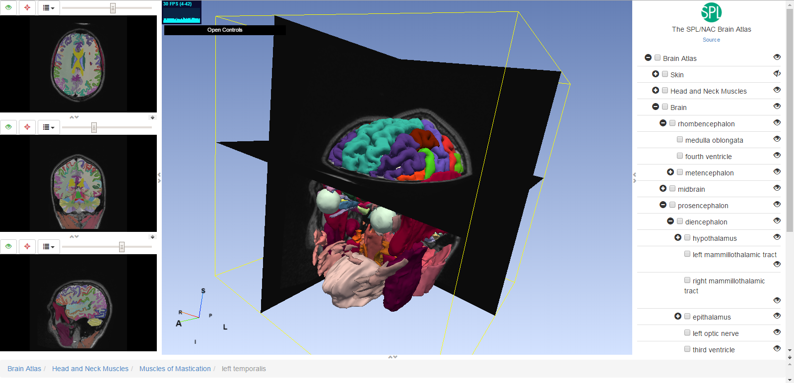

# SPL-PNL Brain Atlas #

The SPL-PNL Brain atlas is an automatic- and expert-segmented model of the human brain derived from data from a single normal subject.

The atlas has been processed and refined over many years by scores of physicians, researchers, and computer scientists from a variety of institutions, including the [Surgical Planning Lab](http://www.spl.harvard.edu) and the [Psychiatry Neuroimaging Lab](http://pnl.bwh.harvard.edu/) at [Brigham and Women's Hospital](http://brighamandwomens.org). The SPL-PNL Brain Atlas provides important reference information for surgical planning. It has been used for template-driven segmentation and also as a neuroanatomy teaching tool.

Over the years, the original atlas has undergone several revisions. The current version consists of:

 * the original volumetric whole brain MRI of a healthy volunteer;
 * a set of detailed label maps;
 * 160+ three-dimensional models of the labeled anatomical structures;
 * a mrml-file that allows loading all of the data into the 3DSlicer for visualization (see the tutorial associated with the atlas);
 * several pre-defined 3D-views for the motor, visual and limbic systems, diencephalon, brain stem, and left cerebral hemisphere.

## Using the data ##

Visualization of the data currently requires [3DSlicer](http://www.slicer.org/). This software package can be downloaded from http://download.slicer.org. We are pleased to make this brain atlas available to our colleagues for free download. Please note that the data is being distributed under the Slicer license.

## Status ##

We are in the process of moving the atlas to Github;  the content here is still in a significant state of flux at this time.  There are some architectural issues that remain to be worked out due to the binary nature of the imaging data and git's ability to handle it without growing the size of the repositories out of hand.

We plan to add additional metadata to the structures contained in the atlas based on medical ontologies including RADLEX and SNOMED-CT (through DICOM).

We will also make available atlas processing, editing, and verification tools as part of another repository.

We welcome anatomical or technical contributions from the greater community.

## Acknowledgement ##

The SPL-PNL Brain Atlas has been developed with support from the National Institutes of Health under grants P41 EB015902/RR/NIBIB (the [Neuroimage Analysis Center](http://nac.spl.harvard.edu/)), P41 RR013218/RR/NCRR and R01 MH050740/MH/NIMH.  Additional support was provided by a Google Research Grant and other sources.

If you should find the atlas useful, please reference it using information at the following URL:
http://www.spl.harvard.edu/publications/item/view/1265 .

## Using the online viewer ##



### Without installation ###

You can [see the latest release here](https://stity.github.io/spl-brain-atlas/utils/three)

### Installing from the git repository ###

* first pull the whole reposity by running : 
`git clone https://github.com/stity/spl-brain-atlas.git`
* make sure that the submodules are up-to-date : 
```
    cd utils/three
    git pull origin master
    cd ../mrmlToJson
    git pull origin master
```
* follow the instructions given by the `utils/mrmlToJson/README.md` starting from copying the config file
* follow the intructions given by the `utils/three/README.md` starting from copying the config file
* run a local server at the root of the cloned repository (you can achieve that by running `npm install -g http-server` and then `http-server`)
* use a browser to go to this address : [http://localhost:8080/utils/three](http://localhost:8080/utils/three)
